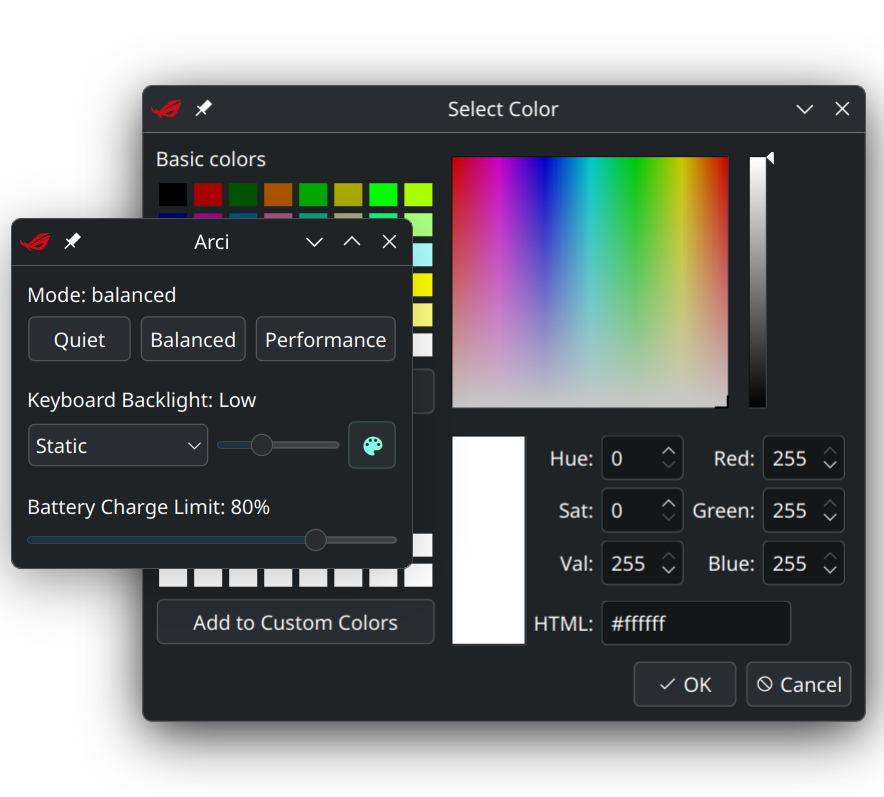

<h1 align="center">ARCI</h1>
<p align="center">ASUS ROG Control Interface</p>

Arci is a simple UI for [**asusctl**](https://gitlab.com/asus-linux/asusctl)  created using PySide6 with basic but useful features.

## Features

- Change power profile (Quiet, Balanced, Performance).
- Change keyboard aura mode.
- Change keyboard RGB brightness level.
- Pick a color for the keyboard backlight (Static, Breathe and Pulse modes only).
- Set the battery charge limit.

## Screenshots




## Installation

1.  **Clone the repository:**
    ```bash
    git clone https://github.com/Jhonnikek/Arci.git
    cd Arci
    ```

2.  **Install dependencies:**

    Arci depends on `pyside6` and `asusctl`. Make sure you have `asusctl` installed and working on your system.

    You can install `pyside6` using pip:
    ```bash
    pip install pyside6
    ```

3.  **Run the application:**
    ```bash
    python app/main.py
    ```